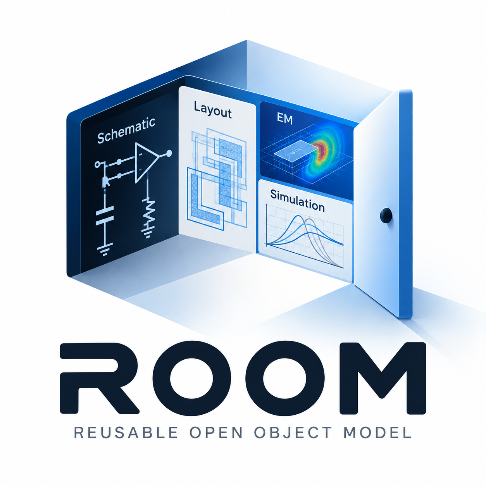

<p align="center">
  
</p>

<h1 align="center">ROOM</h1>

<p align="center">
  <strong>Reusable Open Object Model</strong><br>
  Open-source IC layout and schematic database<br>
  Binary <code>.room</code> files · Cap'n Proto · C++17
</p>

---

**ROOM** — **R**eusable **O**pen **O**bject **M**odel — is an open-source IC design database and C++ API (`room::`) aimed at **production quality**: libraries, cells, layers, shapes, instances, and nets with portable `.room` serialization. Layout and schematic data share one model; the view kind (`layout`, `schematic`, `symbol`, `abstract`) lives in `CellContent`.

See [docs/PRODUCTION_ROADMAP.md](docs/PRODUCTION_ROADMAP.md) for the path from the current MVP to v1.

The project is part of the **IHP** open-source IC design flow. Design data is kept in a format-neutral internal model and serialized to portable binary `.room` files via Cap'n Proto, so tools can load, edit, and save the same representation without tying the database to a single exchange format.

> This repository is maintained with commits/checkins only from the project owner. After clone, run `scripts\setup-githooks.cmd` (Windows) or `./scripts/setup-githooks.sh` (Linux/macOS) once so git hooks strip accidental Cursor co-author trailers from commit messages.

## Data model

**On disk (`.room`, format v1.0):** geometry lives in `CellContent.payload`, not in a top-level `block` field.

```
Database
 └── Lib
      ├── layers[]              ← LayerSpec table (library-global)
      ├── index                 ← LibIndex (derived hierarchy + bboxes, persisted)
      └── Cell[]                ← name, aliases[], optional PCellInfo
           └── CellContent[]     ← viewType, dbuPerMicron, dbuPerEditorUnit, properties, layers[] (per-view)
                └── payload      ← ViewPayload (Cap'n Proto union)
                     ├── layout | schematic | symbol | abstract
                     │    ├── layers[]   (per-view layer table on disk)
                     │    ├── block      (verbose geometry, opt-in)
                     │    └── compact    (layer-grouped geometry, default on save)
                     └── opaque         (skip-friendly unknown views)
```

**C++ API:** `CellContent::block()` is the in-memory accessor for topology; `CellContent::layers()` holds the per-view layer table (`LayerSpec` + `LayerPurpose`). Layout coordinates use `dbuPerMicron`; schematic/symbol coordinates use `dbuPerEditorUnit` (see [docs/html/coordscale.html](docs/html/coordscale.html)). `Cell::aliases()` and `Cell::pCell()` cover PDK cell identity. On save, compact encoding is the default (`SaveOptions::compactGeometry`); load auto-detects `compact` vs `block`. See [docs/COMPACT_ENCODING.md](docs/COMPACT_ENCODING.md) and [docs/SCHEMA_EVOLUTION.md](docs/SCHEMA_EVOLUTION.md).

## Requirements

| Tool | Notes |
|------|--------|
| **CMake** ≥ 3.16 | Configure and build |
| **C++17 compiler** | MinGW-w64 (Windows), GCC or Clang (Linux) |
| **Git** | Clones Cap'n Proto on first configure (if needed) |
| **Cap'n Proto** | Built automatically into `third_party/capnp-install/` by CMake |

On Windows, the repo’s VS Code tasks assume **Qt MinGW 8.1** (`C:/Qt/Tools/mingw810_64`). Adjust compiler paths if you use another toolchain.

## Build

On the **first** `cmake` configure, ROOM builds Cap'n Proto into `third_party/capnp-install/` automatically if it is not already there (option `ROOM_BOOTSTRAP_CAPNP=ON`, default). That step can take several minutes; later configures are instant.

To build Cap'n Proto by hand (optional), see [third_party/README.md](third_party/README.md).

### Configure and compile

**Windows (command line, MinGW Makefiles):**

```bat
cmake -S . -B build -G "MinGW Makefiles" ^
  -DCMAKE_BUILD_TYPE=Debug ^
  -DCMAKE_C_COMPILER=C:/Qt/Tools/mingw810_64/bin/gcc.exe ^
  -DCMAKE_CXX_COMPILER=C:/Qt/Tools/mingw810_64/bin/g++.exe ^
  -DCMAKE_MAKE_PROGRAM=C:/Qt/Tools/mingw810_64/bin/mingw32-make.exe

cmake --build build -j4
```

**Linux:**

```bash
cmake -S . -B build -DCMAKE_BUILD_TYPE=Release
cmake --build build -j$(nproc)
```

### VS Code

Open the folder in VS Code (CMake Tools extension recommended):

1. **CMake: Configure Debug** — configures ROOM and bootstraps Cap'n Proto if needed  
2. **Build: Static Libraries (.a)** — `core`, `room_utils`  
3. **Build: All Targets** — adds `gds_to_room`, `qucs_to_room`, `make_sample_gds`  
4. **Example: GDS to ROOM** / **Example: Qucs to ROOM** — run demos after a full build  

Default build task: **Build: Static Libraries (.a)** (`Ctrl+Shift+B` may need to be bound to that task).

## Tests and code coverage

Tests are built when `ROOM_BUILD_TESTS=ON` (default). Run them with CTest:

```bash
ctest --test-dir build --output-on-failure
```

**Code coverage** (GCC/MinGW + [gcovr](https://gcovr.com/)), same workflow as LibMan:

**Windows:**

```bat
pip install gcovr
scripts\run_tests_coverage.cmd
```

**Linux:**

```bash
pip install gcovr
./scripts/run_tests_coverage.sh
```

The script configures `build-coverage/` with `-DCORE_ENABLE_COVERAGE=ON`, runs all CTest suites, and writes `coverage.html` in the repo root (Windows opens it in the browser). After tests, you can also regenerate the report from an existing coverage build:

```bash
cmake --build build-coverage --target coverage-report
```

CI runs `./scripts/run_tests_coverage.sh` in the **Coverage (Ubuntu)** job (after **Tests** pass) and uploads `coverage.html` (+ detail pages) as the `core-coverage-html` artifact. Windows has no coverage job yet (gcovr targets GCC/MinGW only).

## Build outputs

| Target | Type | Description |
|--------|------|-------------|
| `core` | static library | Database API + Cap'n Proto serialization |
| `room_utils` | static library | GDS / Qucs importers, text dump |
| `gds_to_room` | executable | GDSII → `.room` |
| `qucs_to_room` | executable | Qucs `.sch` → `.room` (round-trip export) |
| `xschem_to_room` | executable | Xschem `.sch`/`.sym` → `.room` |
| `room_to_xschem` | executable | `.room` → Xschem files |
| `room_file_sniff` | test tool | Import + `sniffRoomFile()` smoke test |
| `make_sample_gds` | executable | Minimal sample GDS for tests |

Install headers and libraries into a prefix:

```bat
cmake --install build --prefix install
```

Use `find_package(ROOM)` from another CMake project via `install/lib/cmake/ROOM/`.

## Examples

### GDS layout import

Bundled demo (no arguments — uses `examples/gds_to_room/data/sg13g2_stdcell.gds`):

```bat
build\gds_to_room.exe
```

Custom paths:

```bat
build\gds_to_room.exe input.gds output\layout.room output\layout.txt CELL_NAME
```

### Qucs schematic import

```bat
build\qucs_to_room.exe examples\qucs_to_room\data\rc_lowpass.sch examples\qucs_to_room\output\schematic.room
```

### Xschem schematic / symbol import

```bat
build\xschem_to_room.exe examples\xschem_to_room\data\test.sch examples\xschem_to_room\output\test.schematic.room
```

### Sniff a `.room` file (metadata only)

```cpp
#include "file_summary.h"
room::RoomFileInfo info = room::sniffRoomFile("cell.schematic.room");
```

See [docs/SNIFF.md](docs/SNIFF.md) and [docs/ROOM_FILE_NAMING.md](docs/ROOM_FILE_NAMING.md). HTML API: [filesummary.html](docs/html/filesummary.html).

### Minimal GDS

```bat
build\make_sample_gds.exe testdata\sample.gds
build\gds_to_room.exe testdata\sample.gds output\sample.room
```

## KLayout integration

ROOM ships a **KLayout streamer plugin** (`mroom`) that opens and saves `.room` files directly in KLayout — no GDS round-trip for viewing.

| | |
|--|--|
| **Full guide** | [integrations/klayout/README.md](integrations/klayout/README.md) |
| **What it does** | Read/write `.room` in KLayout; maps shapes, instances, cells, lib name, and properties |
| **Build model** | CommonDB sources are compiled into `db_plugins/mroom.dll` inside a KLayout tree (junction + `streamers.pro` patch) |
| **Quick setup** | `scripts\setup_klayout_mroom.cmd C:\path\to\KLayout` then rebuild KLayout |
| **Smoke tests** | `klayout -b -r scripts\test_room_load.rb` (set `COMMONDB_ROOT` to repo root) |
| **Bridge (no plugin yet)** | `scripts\open_room_in_klayout.cmd` or macro `scripts\klayout_load_room.lym` via `room_to_gds` |

## Documentation

HTML API reference: [`docs/html/index.html`](docs/html/index.html) (open locally in a browser after cloning).

Design docs: [PRODUCTION_ROADMAP.md](docs/PRODUCTION_ROADMAP.md) · [DESIGN_CHARTER.md](docs/DESIGN_CHARTER.md) · [SCHEMA_EVOLUTION.md](docs/SCHEMA_EVOLUTION.md) · [COMPACT_ENCODING.md](docs/COMPACT_ENCODING.md) · [SNIFF.md](docs/SNIFF.md) · [ROOM_FILE_NAMING.md](docs/ROOM_FILE_NAMING.md) · [KLayout plugin](integrations/klayout/README.md)

## Project layout

| Path | Purpose |
|------|---------|
| `src/` | Core C++ API (`Database`, `Cell`, `Shape`, …) |
| `schema/` | Cap'n Proto schemas (`.capnp`) |
| `utils/` | `GdsImporter`, `QucsImporter`, `QucsExporter`, `XschemImporter`, `XschemExporter`, `xschem_bridge`, `TextDumper` |
| `examples/gds_to_room/` | GDS import example + sample data |
| `examples/qucs_to_room/` | Qucs import example + sample `.sch` |
| `examples/xschem_to_room/` | Xschem import example + sample `.sch` |
| `integrations/klayout/` | KLayout `mroom` streamer plugin (read/write `.room`) |
| `third_party/capnp-install/` | Cap'n Proto compiler and libraries |
| `scripts/mkcapnp.cmd` | Build Cap'n Proto on Windows |
| `docs/html/` | Documentation and `logo.svg` |
| `LICENSE` | GNU GPL v3.0 |

## License

ROOM is licensed under the **GNU General Public License v3.0**. See [LICENSE](LICENSE) for the full text.
